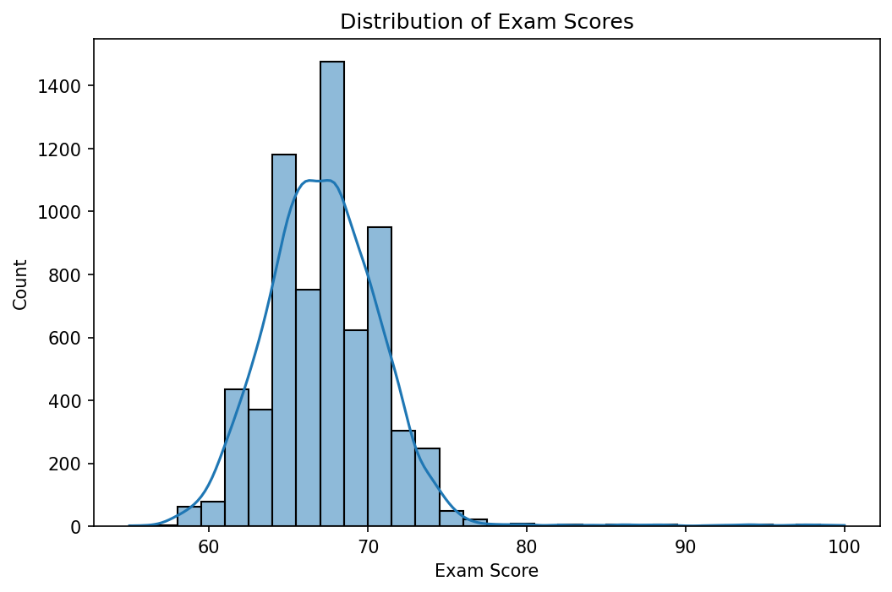
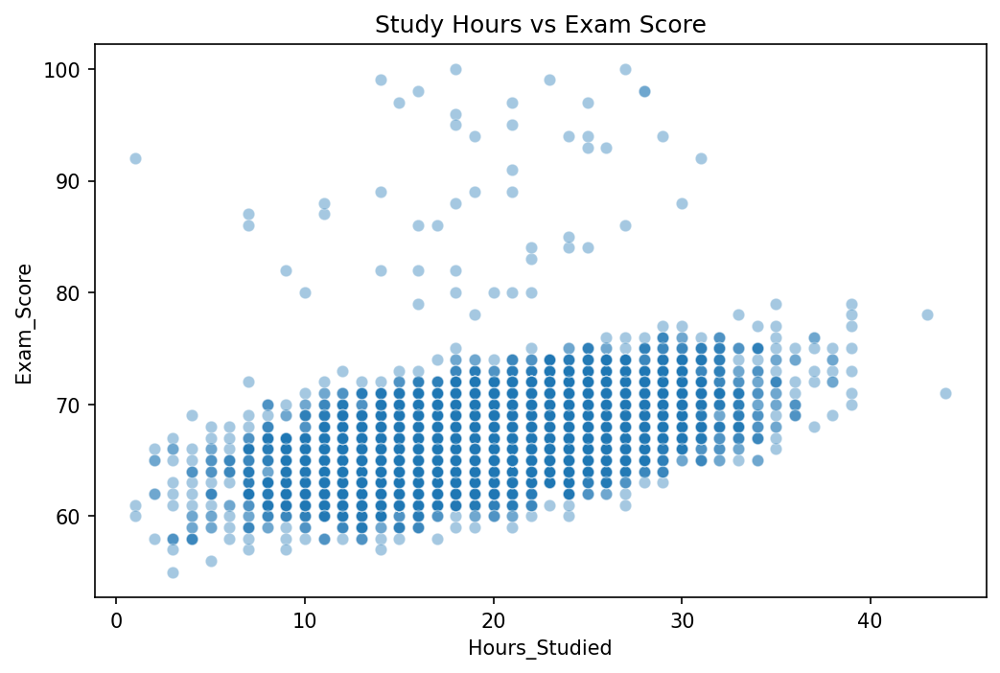
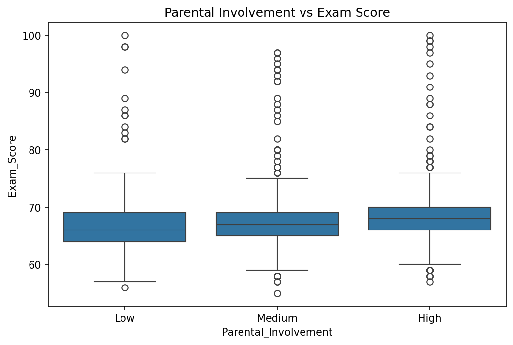
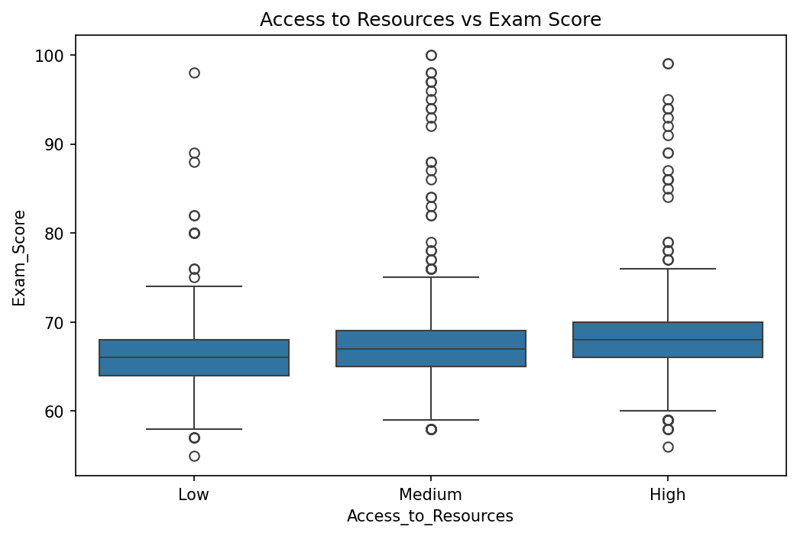
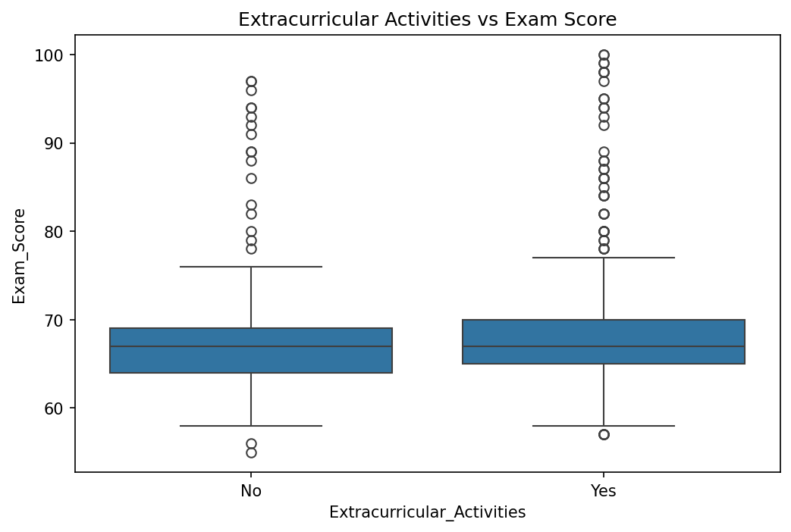
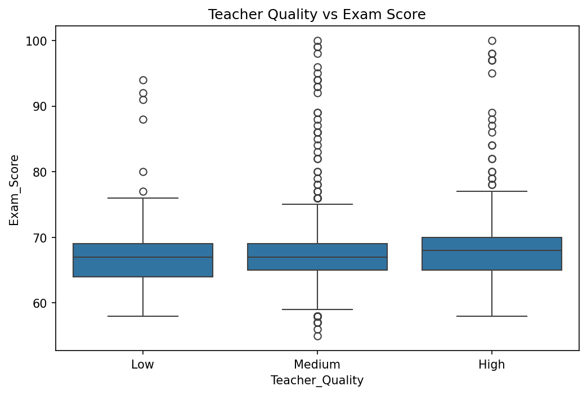

# Student Performance Analysis & Prediction (SVM)

## Objective
Identify the key factors influencing student exam performance, and build a
classification model to predict whether a student will score above or below
the median exam score.

## Dataset
Student Performance Factors dataset — 6,607 students, 19 features including
study hours, attendance, parental involvement, access to resources,
extracurricular activities, and exam scores.

## Approach

### 1. Data Cleaning
- Filled missing values in Teacher_Quality (78), Parental_Education_Level (90), Distance_from_Home (67) using mode
- Capped one invalid Exam_Score outlier (101 → 100)
- No duplicate rows found

### 2. Exploratory Data Analysis
- Exam scores follow a near-normal distribution (mean: 67.2, median: 67)
- Higher study hours correlate positively with exam scores
- Higher parental involvement → higher median scores
- Better resource access → more consistent performance
- Extracurricular participation → slightly higher scores
- Higher teacher quality → higher median scores

### 3. Outlier Detection
- 546 outliers identified (±1.5 std from mean)
- 230 overperformers (score > 73)
- 316 underperformers (score < 61)

### 4. Predictive Modeling
**Model:** Support Vector Machine (SVM) with RBF Kernel  
**Target:** Binary classification — above/below median exam score  
**Split:** 80% train, 20% test  

**Results:**
- Accuracy: 92.7%
- Confusion Matrix:
  - True Negatives: 667
  - True Positives: 558
  - False Positives: 42
  - False Negatives: 55
- Recall (high performers): 91%

## Visualizations

## Exam Score Distribution

## Study Hours vs Exam Score

## Parental Involvement vs Exam Score

## Access to Resources vs Exam Score

## Extracurricular Activities vs Exam Score

## Teacher Quality vs Exam Score

## Tech Stack
Python, pandas, matplotlib, seaborn, scikit-learn, Jupyter

## Author
Mohammed Zabin Shukkoor